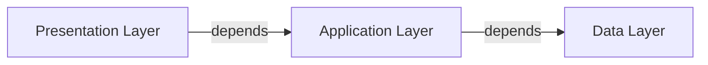

# TaskManager

Simple Java Application about Task Management with notifications functionalities. 

1. [Installation](#Installation)
	1. [Minimal requirements](#Installation/MinimalRequirements)
	2. [Execution](#Installation/Execution)
2. [Architectue](#Architecture)
	1. [Three-Tier Architectute](#Architecture/ThreeTierModel)
		1. [Presentation Layer](#Architecture/ThreeTierModel/Presentation)
		2. [Application Layer](#Architecture/ThreeTierModel/Application)
		3. [Data Layer](#Architecture/ThreeTierModel/Data)
	2. [SOLID Principles](#Architecture/SOLID)
## Installation <a id='Installation'></a>

---

In this section will show how to install and execute the program with minimal requirements. 

### Minimal requirements <a id='Installation/MinimalRequirements'></a>

--- 

It is recommended to have Java OpenJDK 11.0.22, to know your version execute: 

```bash
java --version	
```

If you have a deprecated version, you must update it: 

- Linux:

```bash
sudo apt-get upgrade java -y
```

- Windows: 

`Java Control Panel > General > Update`

### Execution <a id='Installation/Execution'></a>

---

First you have to move to the directory where you downloaded the .zip or cloned repository locally, then when you are inside the directory, execute the next command in terminal(Linux-bash or Windows-powershell) 

```bash
cd my-app/src/main/java
```

Then you have to execute the next command, to create **.class** files:  

```bash
javac com/actividad8/app/App.java
```

And finally with the next command, you execute the program: 

```bash
java com.actividad8.app.App
```

## Architecture <a id='Architecture'></a>

---

This project is guided by Three-tier arquitecture model (Presentation, Application, Data), which will be expanded in detail, and additionaly by SOLID principles. 
### Three-Tier arquitecture<a id='Architecture/ThreeTierModel'></a>

The project is divided in 3 directories, corresponding to each layer in "Three-tier" architecture, and the App.java is for execute the project. 


To understand better this is the graph dependendy: 



#### Presentation Layer <a id='Architecture/ThreeTierModel/Presentation'></a>

---

This layer is specialize in developing interfaces to final-users, in which we are just using the input standard and output standard(terminal) to do all actions.
All this only in the file: `TaskUI.java`.  

#### Application Layer (Bussiness Layer) <a id='Architecture/ThreeTierModel/Application'></a>

---

In this layer we have the services provided by the system, with the typical OOP App. 


#### Data Layer <a id='Architecture/ThreeTierModel/Data'></a>

---

Finally in this layer we have the interfaces to communicate with database, in this case we are not using any database management system, just adding to a List in the same application. 


### SOLID PRINCIPLES <a id='Architecture/SOLID'></a>

---

This is the solid principles section


