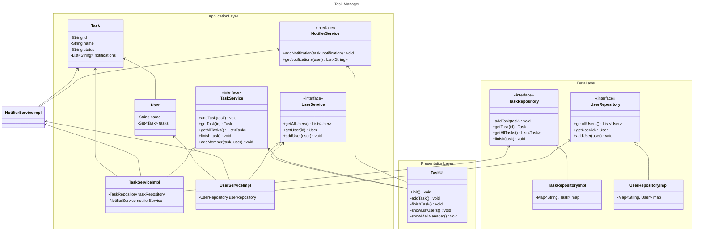

# TaskManager

Simple Java Application about Task Management with notifications functionalities. 

1. [Installation](#Installation)
	1. [Minimal requirements](#Installation/MinimalRequirements)
	2. [Execution](#Installation/Execution)
2. [Architectue](#Architecture)
	1. [Three-Tier Architectute](#Architecture/ThreeTierModel)
		1. [Presentation Layer](#Architecture/ThreeTierModel/Presentation)
		2. [Application Layer](#Architecture/ThreeTierModel/Application)
		3. [Data Layer](#Architecture/ThreeTierModel/Data)
	2. [Pattern Designs](#Architecture/PatternDesigns)
	3. [SOLID Principles](#Architecture/SOLID)
## Installation <a id='Installation'></a>

In this section will show how to install and execute the program with minimal requirements. 

### Minimal requirements <a id='Installation/MinimalRequirements'></a>


It is recommended to have Java OpenJDK 11.0.22, to know your version execute: 

```bash
java --version	
```

If you have a deprecated version, you must update it: 

- Linux:

```bash
sudo apt-get upgrade java -y
```

- Windows: 

`Java Control Panel > General > Update`

### Execution <a id='Installation/Execution'></a>

First you have to move to the directory where you downloaded the .zip or cloned repository locally, then when you are inside the directory, execute the next command in terminal(Linux-bash or Windows-powershell) 

```bash
cd my-app/src/main/java
```

Then you have to execute the next command, to create **.class** files:  

```bash
javac com/actividad8/app/App.java
```

And finally with the next command, you execute the program: 

```bash
java com.actividad8.app.App
```

## Architecture <a id='Architecture'></a>


This project is guided by Three-tier arquitecture model (Presentation, Application, Data), which will be expanded in detail, and additionaly by SOLID principles. 

### Three-Tier arquitecture<a id='Architecture/ThreeTierModel'></a>

---

The project is divided in 3 directories, corresponding to each layer in "Three-tier" architecture, and the `App.java` is for execute the project. 


To understand better this is the graph dependendy: 


#### Presentation Layer <a id='Architecture/ThreeTierModel/Presentation'></a>


This layer is specialize in developing interfaces to final-users, in which we are just using the input standard and output standard(terminal) to do all actions.
All this only in the file: `TaskUI.java`.  

#### Application Layer (Bussiness Layer) <a id='Architecture/ThreeTierModel/Application'></a>

In this layer we have the services provided by the system, with the typical OOP App. Implemented in the directory `BussinessLayer`. 

Detailed services: 
- `Notifier Service` provide functionalities about send a notification and retrieve all notifications by specified user. 
- `Task Service` provide functionalities about task management which includes a interface to data layer or task management features.  
- `User Service` provide functionalities about interface to data layer to users such create, retrieve users. 


#### Data Layer <a id='Architecture/ThreeTierModel/Data'></a>

Finally in this layer we have the interfaces to communicate with database, in this case we are not using any database management system, just adding to a List in the same application. 

The implementation behind wiil guide the repositories idea, it use interfaces to connect to database such that `Application Layer` doesn't need to do some other SQL/No SQL laguage syntax. 

Detailed repositories: 
- `User Repositoy` 
- `Task Repository` 

### Pattern Designs <a id='Architecture/PatternDesigns'></a>

---

Some pattern designs implemented are listed below: 

- **Singleton** used to simulate the behaviour of database service, it is visible in the files: `TaskRepositoryImpl.java` and `UserRepositoryImpl.java`. 
- **Flyweight** used to decrease the auxiliar space for duplicated notifications for a lot of users, it affects the behaviour of User and Task. it is implemented in file: `User.java`, for more detail:


- **Facade** increase the usability, simplifying the functionalities provided by each service robot specified in the *Application Layer*, such implementation is visible in each file: `UserService.java`, `TaskService.java`, `NotifierService.java`. 
- **Command** used to easily implement the interfaces to each option given to end-user. Easily visible through file: `TaskUI.java`.  

### SOLID Principles <a id='Architecture/SOLID'></a>

---

This is the solid principles section. 
- **(S)ingle Responsibility** each class have only one responsability: 
	- `DataLayer/Implementation/TaskRepositoryImpl`: CRUD (Create, Read, Update, Delete) functionality for Task Model. 
	- `DataLayer/Implementation/UserRepositoryImpl`: CRUD (Create, Read, Update, Delete) functionality for User Model.
	- `BussinessLayer/User`: functionality to add tasks. 
	- `BussinessLayer/Task`: functionality to retrieve notifications. 
	- `BussinessLayer/Implementation/UserServiceImpl`: Facade functionality for `UserRepositoryImpl`. 
	- `BussinessLayer/Implementation/TaskServiceImpl`: Facade functionality for `TaskRepositoryImpl`. 
	- `BussinessLayer/Implementation/NotifierService`: Read and write notifications functionalities. 
	- `PresentationLayer/TaskUI`: provides a simple interface to interact to end-user. 
- **(O)pen/Closed** implemented interfaces are *open* for extension such that new functionalities could be added easily, and closed, such that actual interfaces and implementations works correctly. This implementation is visible in `Application Layer` and `Data Layer`. 
- **(L)iskov Substitution** defined interfaces in all system are implemented by a single and specific child class. Like above principle the implementation is visible in the same layers: `Application Layer` and `Data Layer`.
- **(I)nterface Segregation** for each functionality provided, it has a specified interface to implement the correct behaviour, the implementation is inside the next layers: `Application Layer` and `Data Layer`.
- **(D)ependency Inversion Principle** the class dependency for all classes built reference directly to each interface and not the specific implementation. 

To show how it is implemented this is the class diagram: 



